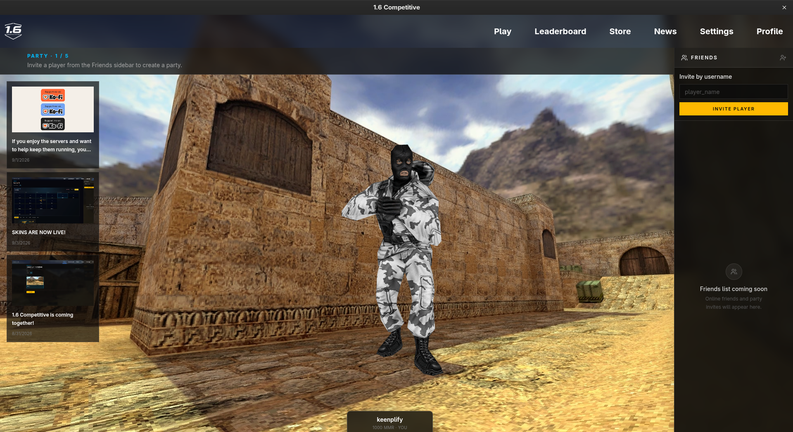
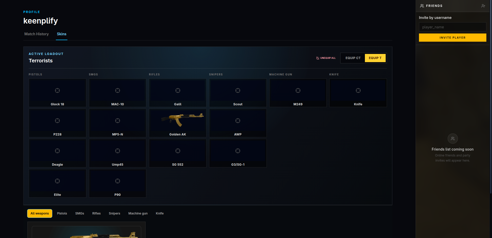

# 1.6 Competitive

<div align="center">
  

  <p><strong>Classic aim. Modern competition.</strong></p>

  <p>A modern matchmaking launcher for Counter-Strike 1.6.<br />Find your squad, customize your loadout, and get into the action.</p>
</div>

<p align="center">
  <a href="../../releases">Download the latest build</a>
  ·
  <a href="../../issues">Report an issue</a>
</p>

## Built for the 1.6 player

Counter-Strike 1.6 is still one of the most satisfying competitive shooters ever made. 1.6 Competitive gives that timeless gameplay a focused home: a clean desktop launcher, matchmaking features, player progression, and a simple path from lobby to server.

<p align="center">
  
</p>

### Bring your party

Create a party, invite players by username, and keep an eye on your group from the lobby. The launcher is designed to make getting a game together feel quick and familiar.

<p align="center">
  
</p>

### Make the loadout yours

Browse your weapon collection and equip skins for Terrorist or Counter-Terrorist loadouts. Cosmetic assets are handled by the launcher and prepared before you connect to a match.

## What’s coming together

- **Matchmaking** — Find and follow competitive matches from the Play screen.
- **Parties and friends** — Invite players and prepare to queue together.
- **Profiles and match history** — Keep your player identity and past games in one place.
- **Weapon skins** — Browse collections and manage active loadouts.
- **A smoother launch flow** — Select your game installation and launch into assigned servers when they are ready.
- **Windows and Linux support** — Built for both platforms from the start. macOS support is planned for the future.

## Match flow

```text
PLAY → Join Queue → Match Found → Prepare Assets → Server Ready → Connect
```

The backend remains authoritative for matchmaking, player identity, inventory, results, and server assignment. The launcher keeps your local setup ready and makes each state easy to understand.

## Project status

1.6 Competitive is under active development. This public repository contains the Electron desktop client and its launcher UI. Features and visuals will continue to evolve as the platform approaches wider release.

## Download

Visit the repository’s **[Releases](../../releases)** page for the latest Windows and Linux builds.

> Counter-Strike 1.6 is required to play. Select and validate your local game executable from the launcher’s Settings tab before joining a match.

## Run locally

### Requirements

- Node.js and npm
- A Counter-Strike 1.6 installation for end-to-end game testing

```bash
npm install
npm run dev
```

To use local API or WebSocket endpoints, copy `.env.example` to `.env` and adjust the development values:

```bash
cp .env.example .env
```

### Build packages

```bash
npm run build:win    # Windows
npm run build:linux  # Linux
```

macOS support is planned for a future release.

Before opening a pull request:

```bash
npm run typecheck
npm run lint
```

## Releases and updates

Releases use calendar SemVer in the format `YYYY.MMDD.REVISION`, for example `2026.903.1`.

```bash
npm run release
```

GitHub Actions builds the Windows and Linux packages and publishes the GitHub Release. Packaged apps check the public release feed at startup and install updates when the app exits.

## Contributing

Issues, feedback, and pull requests are welcome. Please keep the backend authoritative and preserve the secure Electron boundary: filesystem access and game launching belong in the main process, while the renderer receives only narrow, validated APIs.

See [AGENTS.md](AGENTS.md) for the architecture, security expectations, and development guidelines.

## License

License details will be added as the project approaches its first public release.
