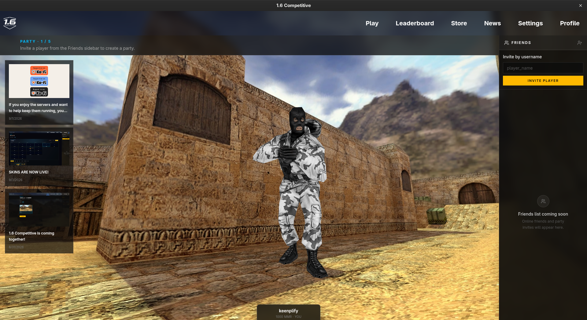
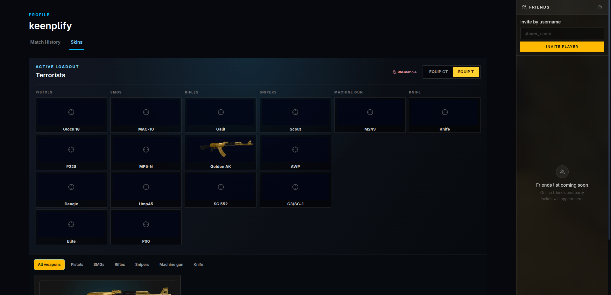

# 1.6 Competitive

<div align="center">
  

  <p><strong>Classic aim. Modern competition.</strong></p>

  <p>A modern matchmaking launcher for Counter-Strike 1.6.<br />Find your squad, customize your loadout, and get into the action.</p>
</div>

<p align="center">
  <a href="../../releases">Download the latest build</a>
  ·
  <a href="../../issues">Report an issue</a>
</p>

## Built for the 1.6 player

Counter-Strike 1.6 is still one of the most satisfying competitive shooters ever made. 1.6 Competitive gives that timeless gameplay a focused home: a clean desktop launcher, matchmaking features, player progression, and a simple path from lobby to server.

<p align="center">
  
</p>

### Bring your party

Create a party, invite players by username, and keep an eye on your group from the lobby. The launcher is designed to make getting a game together feel quick and familiar.

<p align="center">
  
</p>

### Make the loadout yours

Browse your weapon collection and equip skins for Terrorist or Counter-Terrorist loadouts. Cosmetic assets are handled by the launcher and prepared before you connect to a match.

## What’s coming together

- **Matchmaking** — Find and follow competitive matches from the Play screen.
- **Parties and friends** — Invite players and prepare to queue together.
- **Profiles and match history** — Keep your player identity and past games in one place.
- **Weapon skins** — Browse collections and manage active loadouts.
- **A smoother launch flow** — Select your game installation and launch into assigned servers when they are ready.
- **Windows and Linux support** — Built for both platforms from the start. macOS support is planned for the future.

## Crosshair share codes

The desktop crosshair editor imports current CS2 `CS…` share codes and converts
older `CSGO-…` codes to the current format. It uses the MIT-licensed
[csgo-sharecode decoder](https://github.com/akiver/csgo-sharecode), pinned in
`package.json`. Crosshairs are rendered locally during 1.6 Competitive matches;
CS2 weapon spread and scope behavior are approximated from GoldSrc's available
game state. In-game rendering of these codes requires a native cosmetic module
that understands the `cs2` crosshair profile format. Older modules continue to
render legacy JSON profiles, but do not draw imported CS2 codes.

## Counter-Strike configuration safety

`config.cfg` is owned entirely by Counter-Strike and the player. **The launcher must never touch it.**

This is a hard project rule. Launcher code must not read, write, create, replace, append to, rename, delete, repair, seed, or otherwise modify `config.cfg`, even temporarily and even when trying to recover missing bindings or stage match credentials.

Any launcher-owned commands required for a match must use launcher-owned temporary configuration such as `16competitive_match.cfg`, launch arguments, native integration, or another isolated mechanism that does not mutate the player's `config.cfg`.

## Match flow

```text
PLAY → Join Queue → Match Found → Prepare Assets → Server Ready → Connect
```

The backend remains authoritative for matchmaking, player identity, inventory, results, and server assignment. The launcher keeps your local setup ready and makes each state easy to understand.

## Project status

During a match, the launcher checks scoreboard feed, renderer, frame freshness,
and session markers every two seconds. It retries renderer/frame failures after
an eight-second startup grace, with at least 15 seconds between repair attempts.
NextClient sessions wait for the previous match's feed/frame writes and cleanup
before reusing its shared directory. These checks cannot confirm native in-game
hook visibility and do not restart Counter-Strike.

Scoreboard failures are automatically sent to the existing authenticated issue
report API. Reports include detected NextClient versus other/unknown Windows
GoldSrc or Linux GoldSrc, OS release, launcher architecture/version, match ID,
map/round/player count when available, feed version and age, renderer exit reason,
frame/marker health, recovery attempt outcome, and existing launcher diagnostic
logs. They do not collect arbitrary files or scan other processes. Each problem
is reported once per match session (also deduplicated by the API), with up to
three submission attempts. Feed outages must persist for 30 seconds before a
report is sent; brief loading/network gaps are tolerated.

The overtime progress, half-score breakdown, and loss bonus display require the
matching server plugin's v11+ scoreboard feed. The v12 feed also supplies each
player's buy-zone state: the matching native module shows money only during
buy time inside that player's buy zone, shows health otherwise, and suppresses
dead/zero-health tags. This requires a coordinated server, launcher, and signed
native module release. Older feeds remain readable.

1.6 Competitive is under active development. This public repository contains the Electron desktop client and its launcher UI. Features and visuals will continue to evolve as the platform approaches wider release.

## Download

Visit the repository’s **[Releases](../../releases)** page for the latest Windows and Linux builds.

> Counter-Strike 1.6 is required to play. Select and validate your local game executable from the launcher’s Settings tab before joining a match.

On Linux, the AppImage includes automatic updates through Electron's AppImage updater. DEB and Snap packages do not support automatic launcher updates.

## Run locally

### Requirements

- Node.js and npm
- A Counter-Strike 1.6 installation for end-to-end game testing

```bash
npm install
npm run dev
```

To use local API or WebSocket endpoints, copy `.env.example` to `.env` and adjust the development values:

```bash
cp .env.example .env
```

### Build packages

```bash
npm run build:win             # Windows
npm run build:linux           # Linux x64
npm run build:linux:arm64     # Linux ARM64 / aarch64
```

The ARM64 command cross-builds a Linux AppImage from any supported host and is
the supported target for modern ARM Linux devices, including Asahi Linux.

macOS support is planned for a future release.

Before opening a pull request:

```bash
npm run typecheck
npm run lint
```

## Releases and updates

Releases use calendar SemVer in the format `YYYY.MMDD.REVISION`, for example `2026.903.1`.

```bash
npm run release
```

GitHub Actions builds the Windows and Linux packages and publishes the GitHub Release. After pushing the release, the command connects to the `sg`, `na`, and `ws` SSH hosts, runs `git pull --ff-only` in `/root/16competitive`, and runs the web build with the Bun binary at `/root/.bun/bin/bun` on each host. Configure those SSH aliases and non-interactive access before releasing. Packaged apps check the public release feed at startup and install updates when the app exits.

## Discord Rich Presence

The launcher publishes Discord Rich Presence from the Electron main process. It shows whether the player is in the lobby, in a party, searching for a match, at match found, or actively in Counter-Strike. Active matches include the current map, and parties include their current size. While a non-full party is in the lobby, Discord friends can use **Join** to enter that 1.6 Competitive party directly.

Create a Discord application named **1.6 Competitive**, use `resources/icon.png` as its application icon, and upload the same image as a Rich Presence Art Asset with the key `logo`. Then set `DISCORD_CLIENT_ID` when building. Local development can put the value in `.env`. Release builds read the `DISCORD_CLIENT_ID` GitHub Actions environment variable. If you use a different Art Asset key, set `DISCORD_LARGE_IMAGE_KEY` to match.

Discord Rich Presence also works with Vesktop when **Enable Rich Presence via arRPC** is enabled. Native Vesktop and its Flatpak runtime socket are detected automatically. For another sandbox or a custom arRPC server, set `DISCORD_IPC_PATH` to its IPC socket path (use `:` between paths on Linux/macOS and `;` on Windows).

No Discord secret or user token is required. Rich Presence talks only to the locally running Discord desktop client.

## Contributing

Issues, feedback, and pull requests are welcome. Please keep the backend authoritative and preserve the secure Electron boundary: filesystem access and game launching belong in the main process, while the renderer receives only narrow, validated APIs.

See [AGENTS.md](AGENTS.md) for the architecture, security expectations, and development guidelines.

## License

License details will be added as the project approaches its first public release.
