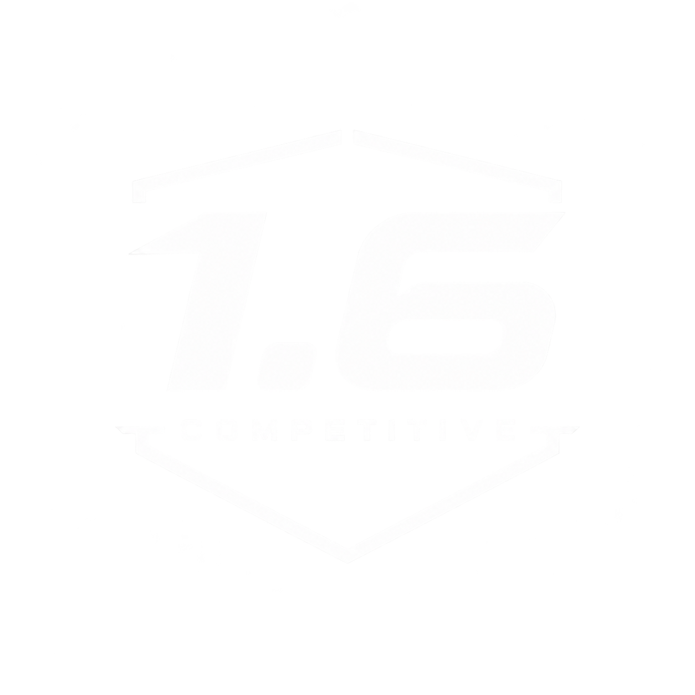

# 1.6 Competitive

  
  
<strong>Classic aim. Modern competition.</strong>

  
A Counter-Strike 1.6 matchmaking platform with a desktop launcher for Windows and Linux.

  <a href="https://www.papamo.dev/1.6competitive">Website</a>
  · <a href="https://github.com/keenplify/16competitive-client/releases">Download</a>
  · <a href="https://discord.com/invite/SgMxrvv7">Discord</a>
  · <a href="https://github.com/keenplify/16competitive-client/issues">Report an issue</a>

## Play the classic, together

1.6 Competitive is in active alpha development. Find teammates, queue for matches,
customize your loadout, and connect to assigned servers from one launcher.
Available modes, maps, rewards, and regional capacity are controlled by the
platform and may change during the alpha.

- **Matchmaking:** competitive 5v5, with additional modes such as Unrated, Legacy,
  3v3, FFA, and Fight Yard when enabled. Follow queue status, accept ready checks,
  and reconnect to active matches.
- **Parties and friends:** invite teammates, chat, and queue together.
- **Profiles and rankings:** view MMR, match history, results, and leaderboards.
- **Cosmetics:** browse your inventory, equip weapon skins, and prepare required
  match assets before connecting.
- **Operations and rewards:** follow active operations, including First Wave,
  and claim rewards as you progress.
- **Regional play:** select available servers in North America, Europe East,
  Southeast Asia, and South America.
- **Desktop integration:** game installation selection, automatic launching,
  launcher updates, and Discord Rich Presence.

## Get started

1. Download an official build from [Releases](https://github.com/keenplify/16competitive-client/releases).
2. Sign in and select your Counter-Strike 1.6 installation in **Settings**.
3. Choose an available region and mode, invite friends if you want, and join the queue.
4. Accept the ready check and let the launcher prepare assets before connecting.

A compatible Counter-Strike 1.6 installation is required for desktop play.
Steam and supported No-Steam installations can be selected. The launcher does
not include Counter-Strike itself.

Windows builds use the installer provided in Releases. Linux builds are
available as AppImages for x64 and ARM64, including modern ARM Linux devices
such as Asahi Linux. Compatibility still depends on the selected game
installation. AppImages support automatic launcher updates; DEB and Snap
packages do not. macOS is not currently a supported release target.

Prefer the browser? Open [Web Play](https://16competitive.papamo.dev/web).
Administrators control the available browser modes; ranked 5v5 awards MMR there
when enabled. Full game-launching and desktop integrations require the launcher.

## Optional in-game enhancements

Managed sessions can provide a custom scoreboard, HUD, teammate indicators,
player pings, and crosshair controls where the game installation and packaged
native module support them. Availability depends on the platform, game build,
and matching server and helper versions.

The crosshair editor imports current CS2 `CS…` share codes and converts older
`CSGO-…` codes using the MIT-licensed
[csgo-sharecode decoder](https://github.com/akiver/csgo-sharecode).
CS2 spread and scope behavior are approximated from available GoldSrc state;
rendering imported codes requires a compatible native module.

**Do not run 1.6 Competitive alongside another client-side anti-cheat.** Close
the managed game and launcher, then start the game normally before using
another anti-cheat client. Third-party anti-cheat compatibility is not claimed.
Managed module changes are scoped to launcher-owned sessions, with cleanup and
recovery mechanisms for game exit, crashes, and interrupted sessions.

## Configuration and diagnostics

`config.cfg` belongs to the player and Counter-Strike. The launcher must never
read, write, create, replace, append to, rename, delete, back up, restore, or
otherwise manipulate it. Match-specific commands use launcher-owned files such
as `16competitive_match.cfg`, launch arguments, or isolated native mechanisms.

Local diagnostic logs cover connectivity, asset preparation, and game launching.
Persistent scoreboard or connection failures can submit automatic issue reports
with relevant launcher/session diagnostics. Submitted issue reports can also
include recent native HUD-cadence FPS samples when available; these estimate
game HUD cadence, not GPU timing or launcher-renderer FPS. Missing samples are
reported as unavailable. Arbitrary local files are not collected for reports.

## About this repository

This public repository contains the Electron desktop client and its renderer.
The stack includes TypeScript, React, Vite, Tailwind CSS, and Zustand. The
renderer uses narrow preload/IPC APIs; filesystem access, asset preparation,
and game launching belong in the main process.

The backend remains authoritative for identity, matchmaking, MMR, inventory
ownership, match results, bans, and server assignment. The separate backend and
private native helper are not included here. This repository alone is not the
complete platform or a self-contained replacement for the official client.

Source is published for inspection. Use the official releases to play. Building,
running, modifying, or reusing the source requires separate written permission.
See [AGENTS.md](AGENTS.md) for architecture and security rules, and [docs](docs)
for integration details relevant to authorized maintainers.

## Feedback

Bug reports and player feedback are welcome through
[Issues](https://github.com/keenplify/16competitive-client/issues) or
[Discord](https://discord.com/invite/SgMxrvv7). Include your launcher version,
platform, what happened, and steps to reproduce. Do not include account tokens,
passwords, or other secrets. Contact us before proposing source changes; the
view-only license does not authorize modifications or contributions by default.

## License — view only

The original project material is proprietary and provided under the
[View-Only Source License](LICENSE). You may inspect it for personal
informational purposes. **No permission is granted to build, run, modify, fork,
redistribute, sell, or reuse it without prior written authorization.**

GitHub's terms independently allow platform forks of public repositories;
this license cannot disable that functionality and grants no additional rights
to use or distribute a fork. The private helper is not included and does not
prevent copying the public source. Third-party components retain their own
licenses. Official prebuilt releases remain subject to their separately granted
end-user permissions.

Counter-Strike and Steam are trademarks and/or registered trademarks of Valve
Corporation. 1.6 Competitive is independent and is not affiliated with or
endorsed by Valve Corporation.
